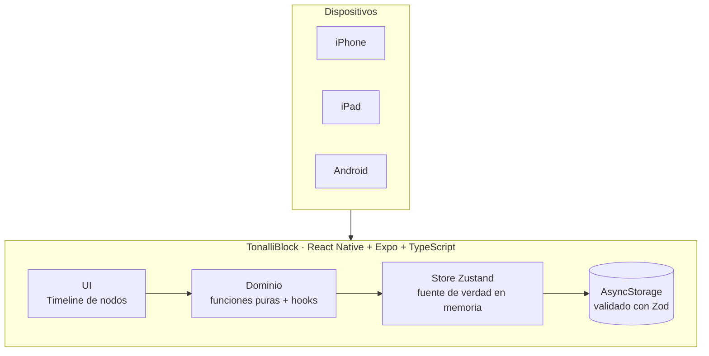

# Architecture

TonalliBlock is a **100% offline** React Native app. There is no backend and no
sync: every read and write is local. This keeps the app fast, private, and
simple, and it matches the reality that a personal planner does not need a
server.

## Layers

```
UI (app/, features/*/components)
  → Domain (features/*/utils, features/*/hooks)   pure logic, no React, no I/O
    → Store (store/block-store.ts)                Zustand + persist middleware
      → Storage (store/storage.ts → AsyncStorage) validated with Zod on read
```

The hard rule: **business logic lives in pure functions** under
`features/*/utils`, never in components or the store. Those functions take the
clock as an argument instead of reading it, so they are deterministic and fully
unit-tested (`__tests__/timeline-layout.test.ts`).

## Data flow



## Key decisions

Each is recorded as an ADR (Architecture Decision Record) in [`adr/`](adr):

1. [Offline-only with AsyncStorage](adr/0001-offline-only-asyncstorage.md) — why
   no SQL, and the performance reasoning behind it.
2. [Wall-clock time model](adr/0002-wall-clock-time-model.md) — why blocks store
   `day` + minute offsets, not UTC instants.
3. [Zod validation at the boundary](adr/0003-zod-validation-at-the-boundary.md) —
   why storage reads are always validated.
4. [Focus-first design for attention](adr/0004-focus-first-design-for-attention.md)
   — the ADHD-oriented UI rules that govern layout and motion.
5. [Recurrence: virtual expansion](adr/0005-recurrence-virtual-expansion.md) — a
   recurring block is stored once and projected onto each matching day.
6. [Vivid category colors on warm-black](adr/0006-vivid-category-colors-on-warm-black.md)
   — how "more color" and "one clear focus" coexist.
7. [Reschedule shortcut, not drag](adr/0007-reschedule-shortcut-not-drag.md) — why
   a long-press quick-shift menu replaces free-form dragging.
8. [Backup/restore replaces, doesn't merge](adr/0008-backup-restore-replace-not-merge.md)
   — the JSON export/import format and why restore is destructive-with-confirmation.

## Domain model (Phase 2)

```
Block ──categoryId──> Category (fixed, built-in set)
  │
  ├──recurrenceId──> Recurrence (daily / weekdays / weekly)
  │
  └──(id, day) pair──> Completion[]  (done/not-done, independent per occurrence)

Backup = { version, exportedAt, blocks[], recurrences[], completions[] }
  — a point-in-time export of the three collections above; see ADR 8.
```

Completion lives outside `Block` specifically so a *recurring* block can be
completed on one day and not another — see ADR 5. Stats
(`features/stats/utils/stats.ts`) aggregate over `Completion[]` joined against
`Block` for duration and category, entirely as pure functions.

## Deferred to later phases

- **Per-occurrence overrides for recurring blocks** (skip one day, edit just one
  instance) — editing/deleting/rescheduling always acts on the whole series
  for now. See ADR 5.
- **A side-by-side week grid.** Phase 2 shipped day navigation (a week strip),
  not a week-at-a-glance view — see the README roadmap.
- **Free-form drag to reschedule** — replaced by a long-press shortcut. See ADR 7.
- **List virtualization** (FlashList) — the day view holds ~30 blocks, below the
  point where it pays off.
- **A live-updating clock** — the "now" indicator reflects the time as of the
  last render, not a ticking timer; it updates whenever the screen re-renders
  for another reason (e.g. returning to it). A `setInterval` tick can be added
  if this proves annoying in practice.
- **Backups from before this version** — a backup made before category colors
  were retired (ADR 6) would fail block validation and be rejected on restore;
  only backups made with the current schema are guaranteed to restore.
- **The separate `TimelineSpine` component** from the original plan was dropped:
  the spine is composed from per-node segments in `TimelineNode`, which
  guarantees continuity without measuring total height.
