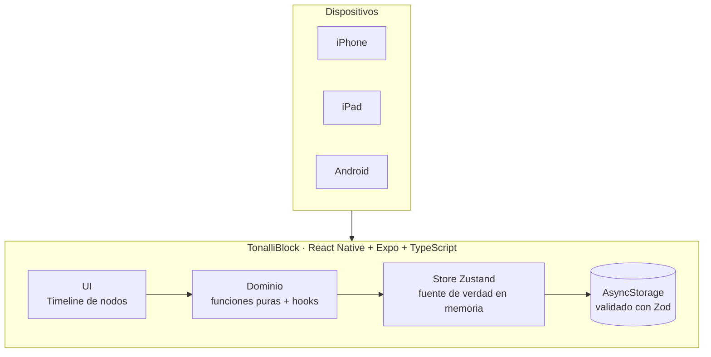

# Architecture

TonalliBlock is a **100% offline** React Native app. There is no backend and no
sync: every read and write is local. This keeps the app fast, private, and
simple, and it matches the reality that a personal planner does not need a
server.

## Layers

```
UI (app/, features/*/components)
  → Domain (features/*/utils, features/*/hooks)   pure logic, no React, no I/O
    → Store (store/block-store.ts)                Zustand + persist middleware
      → Storage (store/storage.ts → AsyncStorage) validated with Zod on read
```

The hard rule: **business logic lives in pure functions** under
`features/*/utils`, never in components or the store. Those functions take the
clock as an argument instead of reading it, so they are deterministic and fully
unit-tested (`__tests__/timeline-layout.test.ts`).

## Data flow



## Key decisions

Each is recorded as an ADR (Architecture Decision Record) in [`adr/`](adr):

1. [Offline-only with AsyncStorage](adr/0001-offline-only-asyncstorage.md) — why
   no SQL, and the performance reasoning behind it.
2. [Wall-clock time model](adr/0002-wall-clock-time-model.md) — why blocks store
   `day` + minute offsets, not UTC instants.
3. [Zod validation at the boundary](adr/0003-zod-validation-at-the-boundary.md) —
   why storage reads are always validated.
4. [Focus-first design for attention](adr/0004-focus-first-design-for-attention.md)
   — the ADHD-oriented UI rules that govern layout and motion.

## Deferred to later phases

- **Recurrence materialization** (virtual expansion vs. materialized rows) — the
  model supports both; the choice waits until the UI exists (Phase 1).
- **List virtualization** (FlashList) — the day view holds ~30 blocks, below the
  point where it pays off. Introduced with the week view (Phase 2).
- **The separate `TimelineSpine` component** from the original plan was dropped:
  the spine is composed from per-node segments in `TimelineNode`, which
  guarantees continuity without measuring total height.
